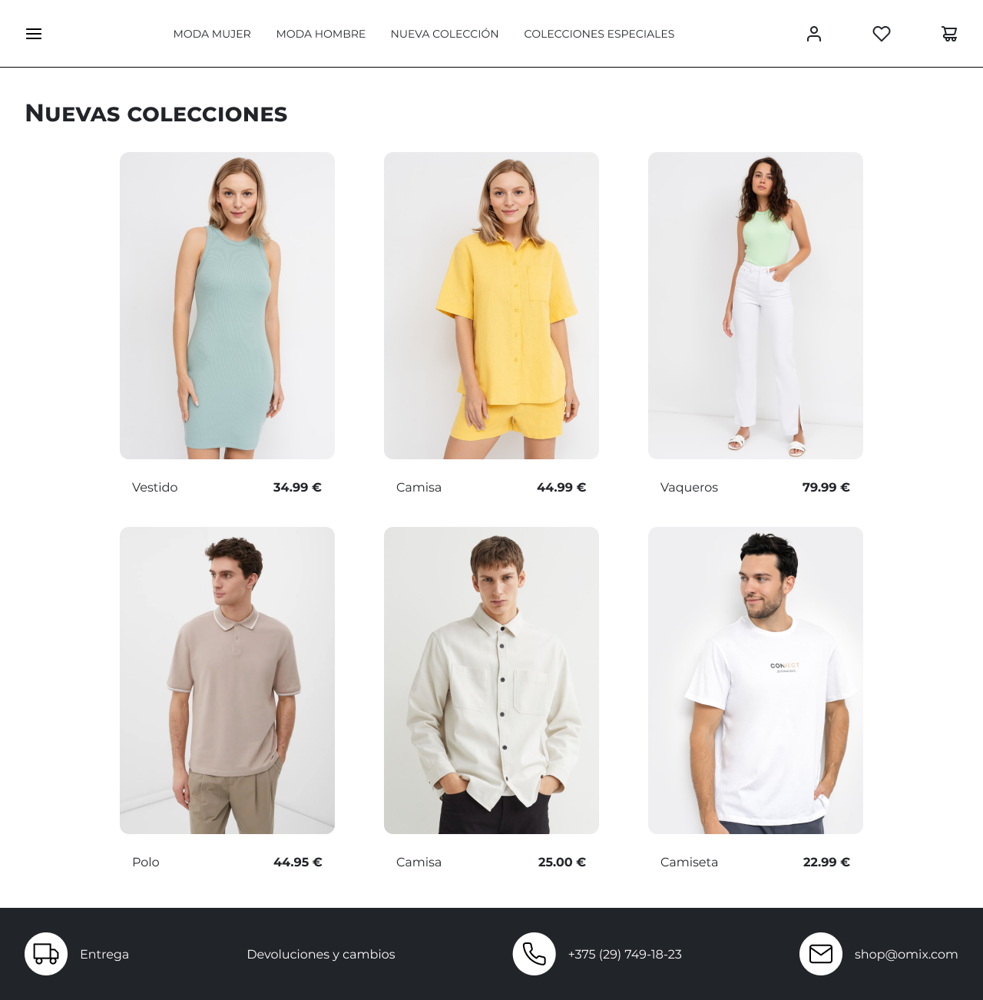
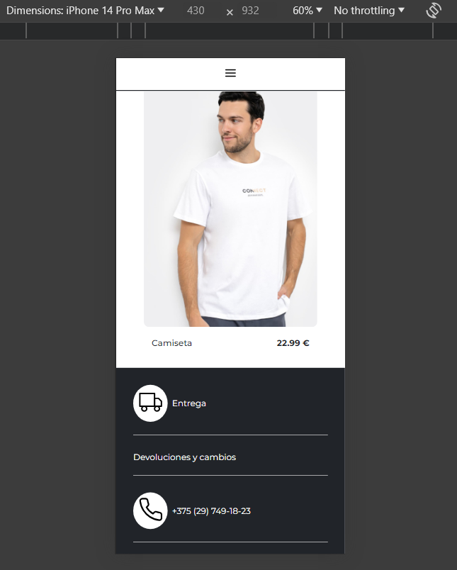

# Laboratorio Módulo 1 - HTML => ([🚀live](https://lemoncodelab01.netlify.app/))
## Descripción del ejercicio:

La práctica es un ejercicio de maquetación sin ninguna navegación, el objetivo es maquetar el contenido principal de la página (Nuevas colecciones) haciendo que el contenido se adapte de manera responsiva si el tamaño de pantalla cambia.

### Resultado esperado:


Se han utilizado propiedades ***grid*** y ***@media-queries*** para que el contenido principal se adapte a todas las resoluciones.

```CSS
@media (min-width: 920px){
    .product-grid {
        display: grid;
        grid-template-columns: repeat(3,1fr);
        column-gap: 5%;
        row-gap: 3%;
    }
}
```

### Apartado opcional - Nav y Footer:

Se han añadido la barra de navegación y el footer al diseño básico de la página, para ello se han utilizado propiedades ***flex***

Además, se ha fijado el contenido de la barra superior para que siga en pantalla mientras se realiza scroll, para ello se ha utilizado la propiedad ***position: sticky***

```CSS
nav {
    position: sticky;
    top: 0;
    left: 0;
    display: flex;
    flex-wrap: wrap;
    justify-content: space-between;
    align-content: center;
    align-items: center;
    z-index: 1;
}
```

Estos también se adaptan cuando el ancho de la pantalla es menor a 920px, para ello se han utilizado de nuevo ***@media-queries*** 



### Apartado opcional - Transiciones y animaciones:

Se han añadido algunas animaciones con css cuando se hace ***:hover*** en las imágenes de producto y los enlaces del menú.

En la barra de navegación sólo cambia el ***background-color*** mientras que en las tarjetas se juega con el ***filter: brightness*** y el ***box-shadow***


```CSS
.product-card img {
    width: 100%;
    border-radius: 10px;
    cursor:pointer;
    filter:brightness(100%);
    transition: all 0.2s;
}
.product-card img:hover {
    filter:brightness(105%);
    -webkit-animation: shadow-drop-center 0.4s cubic-bezier(0.250, 0.460, 0.450, 0.940) both;
	animation: shadow-drop-center 0.4s cubic-bezier(0.250, 0.460, 0.450, 0.940) both;
}

@-webkit-keyframes shadow-drop-center {
    0% {
    -webkit-box-shadow: 0 0 0 0 rgba(0, 0, 0, 0);
        box-shadow: 0 0 0 0 rgba(0, 0, 0, 0);
    }
    100% {
    -webkit-box-shadow: 0 0 20px 0px rgba(0, 0, 0, 0.35);
        box-shadow: 0 0 20px 0px rgba(0, 0, 0, 0.35);
    }
}
@keyframes shadow-drop-center {
    0% {
    -webkit-box-shadow: 0 0 0 0 rgba(0, 0, 0, 0);
        box-shadow: 0 0 0 0 rgba(0, 0, 0, 0);
    }
    100% {
    -webkit-box-shadow: 0 0 20px 0px rgba(0, 0, 0, 0.35);
            box-shadow: 0 0 20px 0px rgba(0, 0, 0, 0.35);
    }
}
```