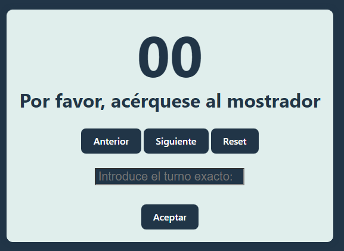

# Laboratorio Módulo 4 - Funciones => ([🚀live](https://next-turn.netlify.app/))
## El Turno Actual ([TypeScript](https://github.com/oleojake/bootcampjs-lemoncode/blob/main/lab_04/src/main.ts)) ([JavaScript](https://github.com/oleojake/bootcampjs-lemoncode/blob/main/lab_04/src/main.js))

### Descripción del ejercicio:

Queremos implementar una pantalla en la que aparezca un display con el turno actual de una clínica y un botón para pasar al siguiente turno y otro para volver al anterior.

### Básico:
1. En grande se muestra el turno.
2. El operario puede ir dándole a siguiente o anterior y el turno cambia.
3. Además de esto vamos a añadir un botón de reset que pone el turno a 0.



Se añaden los Listeners para cada botón.
````JavaScript
const botonAnteriorElement = document.getElementById("boton-turno-anterior");
if (botonAnteriorElement!== null && botonAnteriorElement !== undefined && 
    botonAnteriorElement instanceof HTMLButtonElement) {
        botonAnteriorElement.addEventListener("click", () => handleButtonTurn(botonAnteriorElement.id));
}
````
En la función se identifica de dónde proviene el click para saber qué resultado reflejar
````JavaScript
switch(botonPulsadoID){
    case "boton-turno-anterior":
        if (turnoActual > 0){
            actualizarTurno(turnoActual - 1);
        }
    break;
    case "boton-turno-siguiente":
        actualizarTurno(turnoActual + 1);
    break;
    case "boton-turno-reset":
        actualizarTurno(0);
    break;
}
````

### Avanzado:
Como challenge puedes añadir una caja de texto y un botón que permita cambiar el turno a un valor que ponga el operario.

Además del input se ha añdido un cuadro de texto donde aparecen advertencias por ejemplo, en el caso de que se haya introducido un número menor que 0, o se haya dejado la caja en blanco:

````JavaScript
else if (parseInt(inputValue) < 0) {
    mostrarWarningMessage("Debes introducir un número mayor que 0");
}
````

### Challenge:
Sea el número que sea, lo quiero mostrar siempre con dos digitos (es decir el 1 -> 01, el 2 -> 02, el 10 -> 10, el 11 -> 11, etc), investiga como puedes formatear un número para que siempre tenga dos dígitos.

Para ello se ha utilizado al función PadStart:
````JavaScript
turnoElement.innerHTML = puntuacion.toString().padStart(2,'0');
````