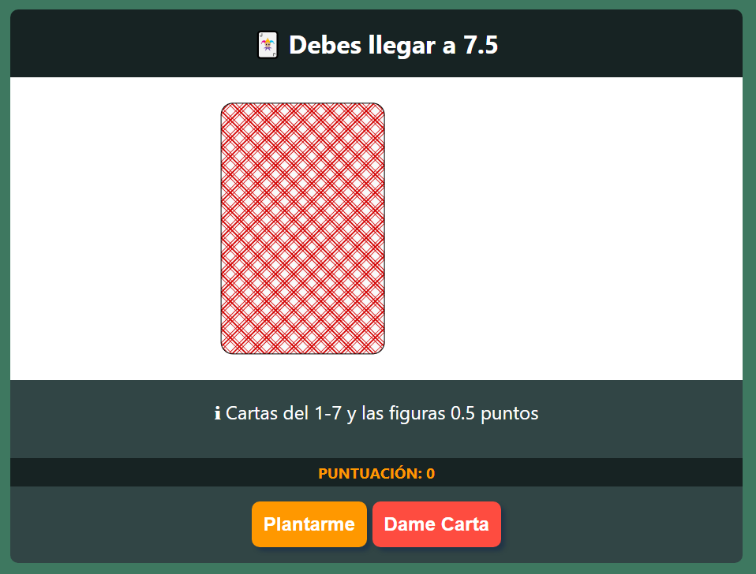
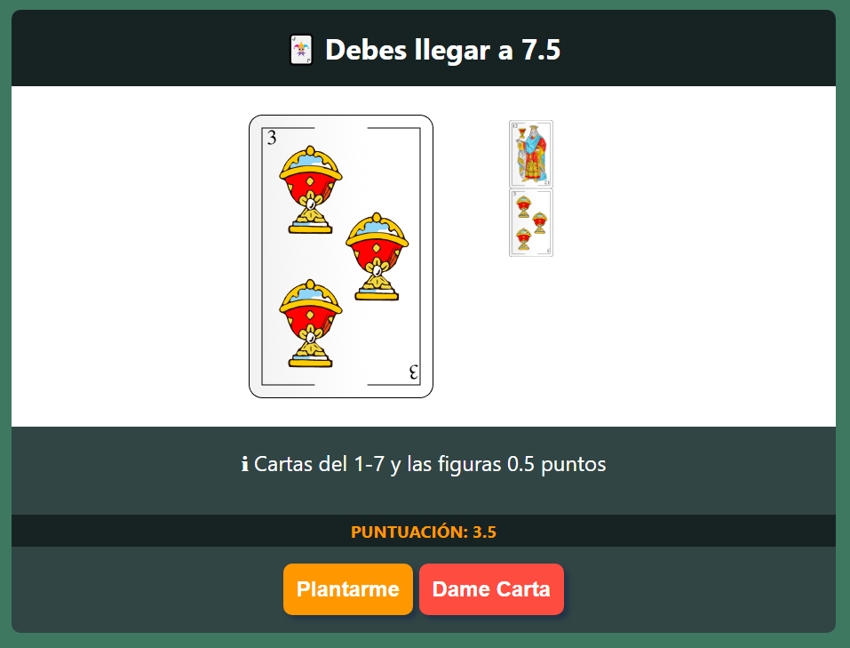
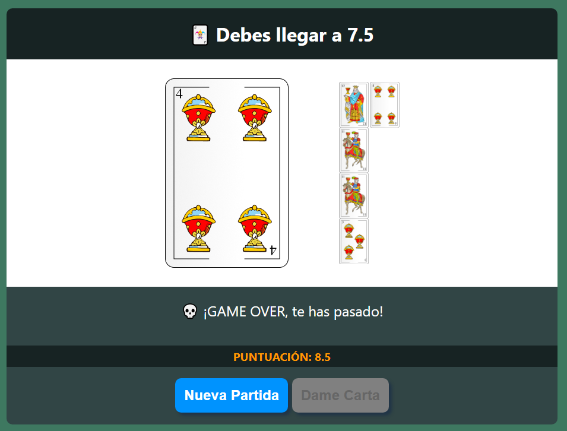
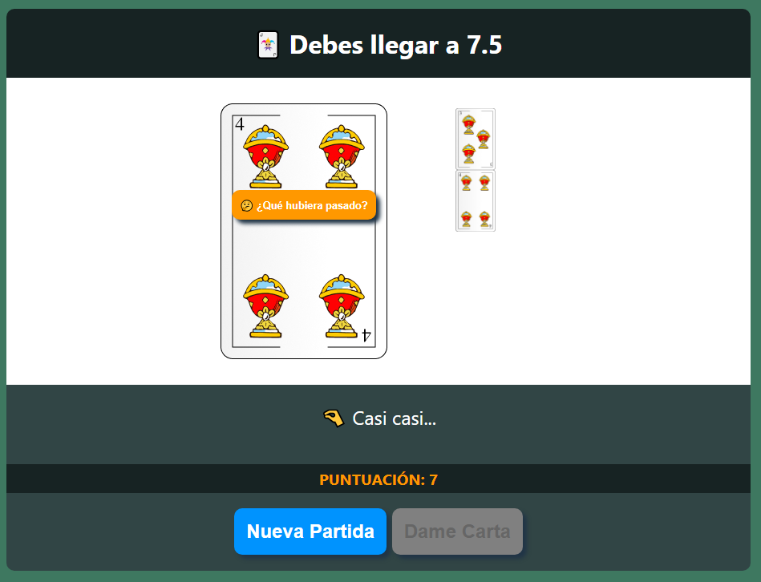
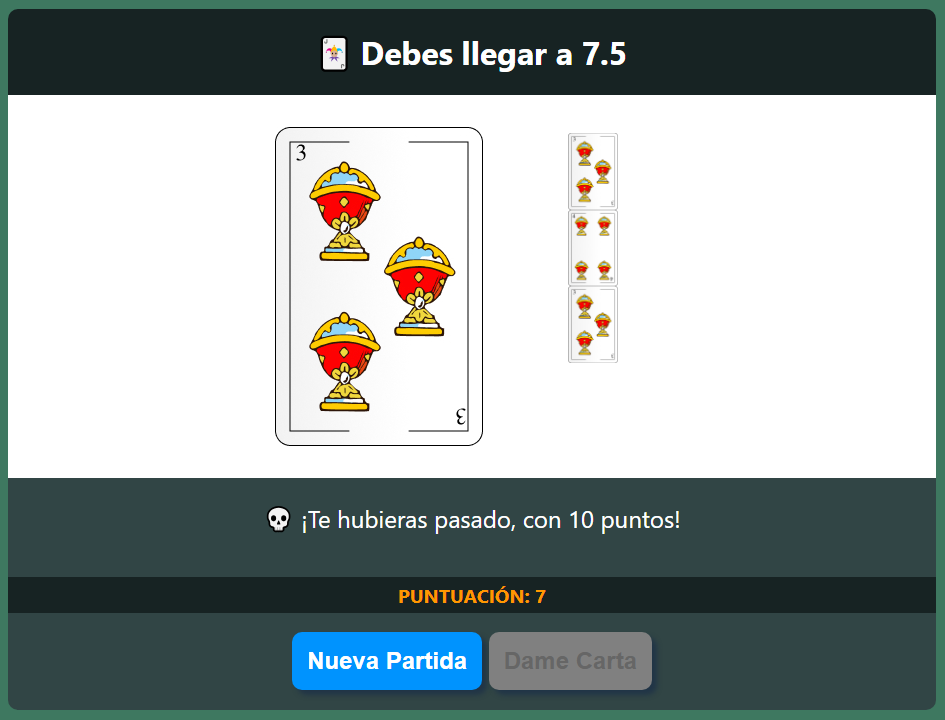
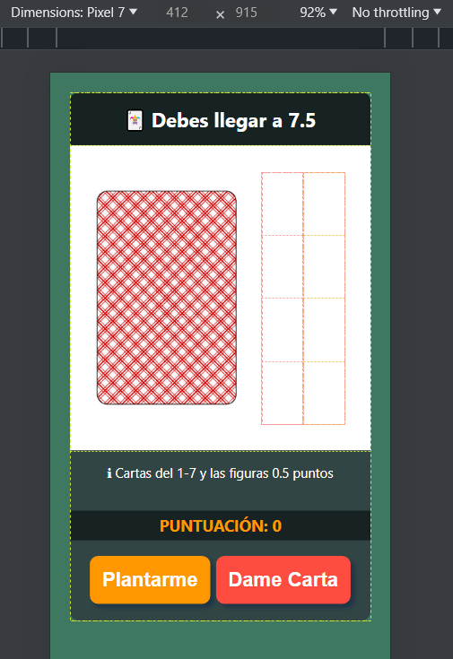

# Laboratorio Módulo 5 - Condicionales => ([🚀live](https://solitario75.netlify.app))
## Juego de las siete media ([TypeScript](https://github.com/oleojake/bootcampjs-lemoncode/blob/main/lab_05/src/main.ts)) ([JavaScript](https://github.com/oleojake/bootcampjs-lemoncode/blob/main/lab_05/src/main.js))

### Descripción del ejercicio:

Decide si deseas tomar otra carta o quedarte con la que tienes. El objetivo del juego es tener una mano que sume 7 y media puntos o lo más cerca posible de este número sin pasarse.

Es importante recordar que las cartas numéricas valen su valor nominal, es decir, el As (uno de cada palo) vale 1 punto, las cartas del 2 al 7 valen su valor nominal y las figuras (sota, caballo y rey) valen medio punto cada una.

### Mostrar puntuación, Pedir Carta, Mostrar Carta y Sumar Puntuación:

Devuelve una carta aleatoria de las 10 disponbiles y la muestra por pantalla, se actualiza la puntuación del usuario.

#### Extra: Se ha añadido una columna con el historial de cartas que han ido apareciendo

### Game Over:

Si el usuario se pasa de 7,5 puntos, el juego termina y se muestra un mensaje de Game Over, además el usuario no puede seguir pidiendo cartas.

### Me Planto:

Añadir un botón para que el usuario pueda plantarse, si el usuario se planta, el juego termina, el usuario no puede pedir más cartas.

#### Extra (Saber lo que habría pasado): Una vez que el usuario ya se ha plantado, se le muestra un botón para que pueda saber lo que habría pasado si hubiera seguido pidiendo cartas.

Si se le hace click muestra la carta siguiente y cuál hubiera sido el resultado pero no cuenta como jugada:

### Nueva Partida:

Una vez que el usuario ha terminado la partida (sea porque se ha plantado o porque ha perdido), se le muestra un botón para que pueda empezar una nueva partida.

### Estila la aplicación

Se han añadido normas media queries para que la aplicación se visualiza correctamente en dispositivos móviles.

