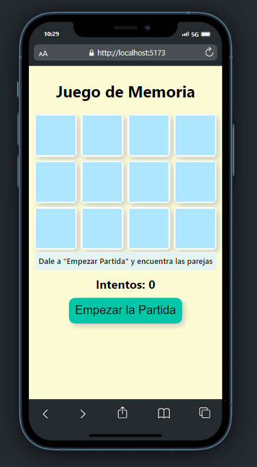

# Laboratorio Módulo 8.3 - Aplicación de Memoria => 
## Software Hospitalario ([TypeScript](https://github.com/oleojake/bootcampjs-lemoncode/blob/main/lab_08_03/src/))

Queremos implementar el clásico juego de las parejas ¿En que consiste esto?

- Mostramos al usuario 12 cartas boca abajo.
- El usuario pincha en una carta y se ve el contenido de la misma (por ejemplo un gatito).
- El usuario pincha en otra carta y se ve el contenido de la misma
-   Si por ejemplo es un perrito, ambas cartas se ocultan y vuelta a empezar.
- Si es un gatito (y la carta origen era el mismo gatito), se quedan las dos cartas bocarriba y el usuario vuelve a jugar.
- Esto así hasta que el usuario encuentre todas las parejas.

#### [Prueba de concepto 1 - barajar las cartas](https://github.com/oleojake/bootcampjs-lemoncode/blob/main/lab_08_03/src/prueba1)
#### [Prueba de concepto 2 - Mostrar imagen y volver la carta](https://github.com/oleojake/bootcampjs-lemoncode/blob/main/lab_08_03/src/prueba2)
#### [Prueba de concepto 3 - Mostrar un Grid de cartas](https://github.com/oleojake/bootcampjs-lemoncode/blob/main/lab_08_03/src/prueba3)
#### [Prueba de concepto 4 - Mostrar segunda imagen y volver las dos cartas](https://github.com/oleojake/bootcampjs-lemoncode/blob/main/lab_08_03/src/prueba4)
#### [Prueba de concepto 5 - Mapear el DIV que contiene la carta con la posición del array de las cartas](https://github.com/oleojake/bootcampjs-lemoncode/blob/main/lab_08_03/src/prueba5)

## Resultado Final

El juego se ha implementando siguiendo las directrices del enunciado, el usuario debe voltear las cartas y memorizar las imágenes para emparejarlas.

!([/src/content/readme_img/ScreenGif.gif](https://github.com/oleojake/bootcampjs-lemoncode/blob/main/lab_08_03/src/content/readme_img/ScreenGif.gif))

### Apartados opcionales implementados

✔️ Mostrar cuantos intentos lleva el usuario.

✔️ Mostrar una animación cuando el usuario pinche en una carta.

✔️ Mostrar un efecto hover cuando el usuario ponga el ratón sobre una carta.

✔️ Que si el usuario pincha en una carta ya volteada le salga un mensaje.

✔️ También se ha adaptado para un diseño responsive

