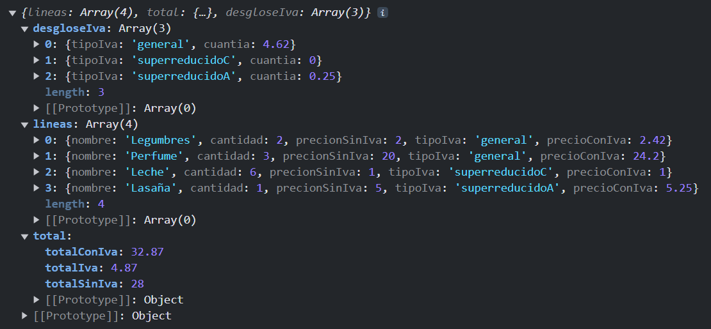

# Laboratorio Módulo 9.1 - Ticket de la Compra => 
## Software Hospitalario ([TypeScript](src/))

Vamos a hacer un programa que nos calcule el precio de un ticket de compra.

El ticket de compra tendrá una serie de líneas de ticket, cada una de ellas con un producto y una cantidad.

La función calculaTicket devolverá un ticket que contendrá la siguiente información:

- Por cada producto queremos el nombre, la cantidad, el precio sin IVA, el tipo de IVA y el precio con IVA.

- En cuanto a los totales: El total sin IVA. El IVA. Un desglose del total por tipo de IVA, es decir, la suma de los importes correspondientes a cada tipo de IVA y El total del ticket, incluyendo el IVA.

````JavaScript
interface ResultadoLineaTicket {
  nombre: string;
  cantidad: number;
  precionSinIva: number;
  tipoIva: TipoIva;
  precioConIva: number;
}

interface ResultadoTotalTicket {
  totalSinIva: number;
  totalConIva: number;
  totalIva: number;
}

interface TotalPorTipoIva {
  tipoIva: TipoIVA;
  cuantia : number;
}
````

El resultado debe ser un TicketTotal que agrupe toda esta información. 

````JavaScript
interface TicketFinal {
  lineas: ResultadoLineaTicket[];
  total: ResultadoTotalTicket;
  desgloseIva: TotalPorTipoIva[];
}

const calculaTicket = (lineasTicket: LineaTicket[]): TicketFinal => {

    const calculoLineas : ResultadoLineaTicket[] = calculoLineasTicket(lineasTicket);
    const calculosTotales : ResultadoTotalTicket = calculoTotales(calculoLineas)
    const calculoDesgloseIVA : TotalPorTipoIva[] = calculoDesglosePorIVA(calculoLineas);

    const ticketFinal : TicketFinal = {
        lineas: calculoLineas,
        total: calculosTotales,
        desgloseIva: calculoDesgloseIVA
    }

    return ticketFinal
}
````

Cada información se ha calculado en *helpers* independientes: 
- [Calculo de Lineas del Ticket](src/lineas-ticket.helper.ts)
- [Calculo de los Totales](src/totales.helper.ts)
- [Calculo del desglose por IVA](src/desglose-iva.helper.ts)

## Resultado por Consola

