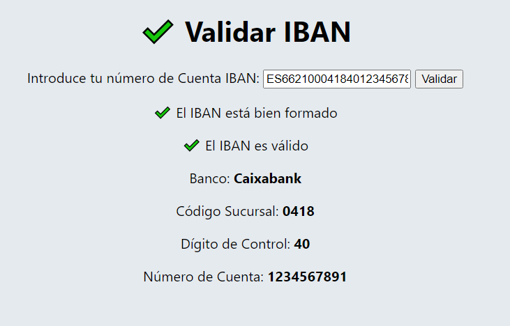
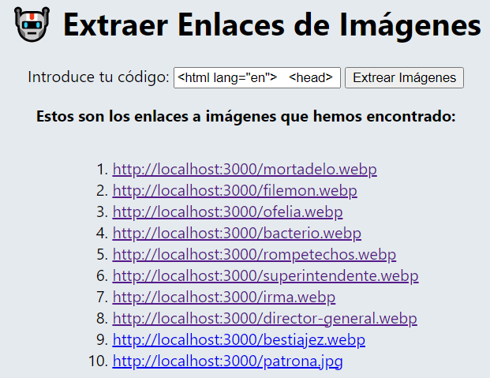
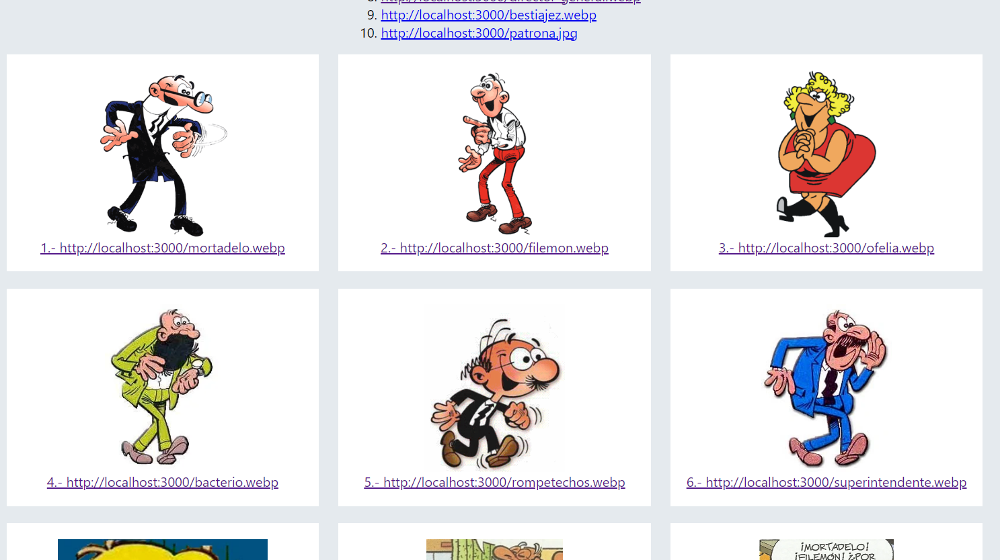

# Laboratorio Módulo 11 - Expresiones Regulares 
## Parte 1: Validar IBAN => ([TypeScript](src/validar-iban))

Vamos a leer IBAN de cuentas de bancos españoles, ver que estar bien formado, validarlo y extraer información del mismo, mock de la aplicación:

Queremos poder leer IBAN con espacios, sin espacios, o guiones, por ejemplo:

- ES21 1465 0100 72 2030876293
- ES2114650100722030876293
- ES21-1465-0100-72-2030876293
- ES6621000418401234567891

Se debe mostrar por pantalla:

- El banco al que pertenece, para ello:
- La oficina.
- El digito de control.
- La cuenta.

Se ha utilizado la siguiente expresión regular para extraer los datos del número de cuenta
````JavaScript
const regex =/^[A-Z]{2}\d{2}(\s|-)?(?<banco>\d{4})(\s|-)?(?<sucursal>\d{4})(\s|-)?(?<digitoControl>\d{2})(\s|-)?(?<numeroCuenta>\d{10})$/;
````



## Parte 2: Extraer Enlaces de Imágenes => ([TypeScript](src/extraer-enlaces))

Crea una aplicación con un textarea y un botón de "extraer enlaces a imágenes". Cuando se pincha en el botón extrae los enlaces a las imágenes que haya en el textarea y las muestra en pantalla.

````JavaScript
export const extraerEnlaces = (codigo : string) : string[] => {
    // Extraemos las img
    const regex =/.*)"/;
    if(elementosIMG){
        for(let i = 0; i < elementosIMG.length; i++){
            const coincidencia = regexExec.exec(elementosIMG[i]);
            if(coincidencia) {
                const {src} = coincidencia.groups as any;
                // Las limpiamos
                const srcLimpia = src.replace(/\/\./,"")
                atributosSRC[i] = srcLimpia;
            }
        }
    }    
    return atributosSRC;
}
````


### (Opcional) Apartado opcional: Puedes también mostrar las imágenes en un CSS Grid o un contendor Flexbox.

*Para ello es necesario tener encendido el servidor de personajes utilizado en el laboratorio anterior.*



### (Opcional) Se ha añadido otra filtro con expresiones regulares para asignar el atributo ALT de las imágenes.

````JavaScript
export const extraerNombreImagenes = (src : string) : string => {
    const regex = /[\w-]+\./i;
    const filename = (src.match(regex));
    if(filename){
        const filenameLimpio = filename[0].replace(/\./,"");
        return filenameLimpio;
    }
    return src;
}
````