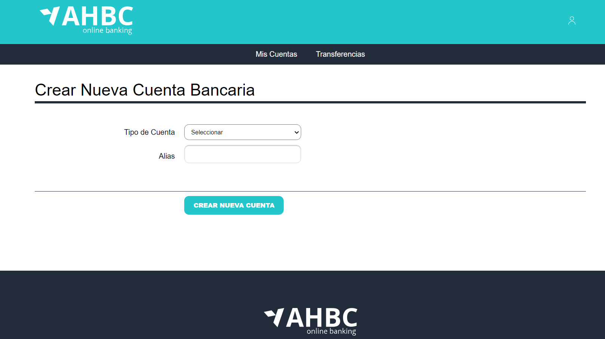
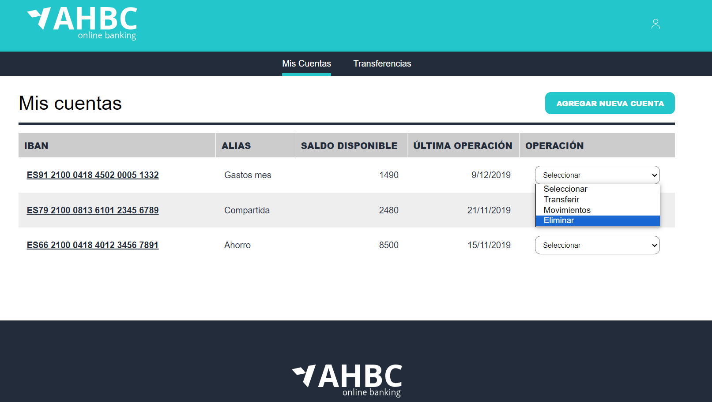

# Laboratorio REACT Módulo 13 - Banca Online
## Parte 2: Agregar Cuenta => ([TypeScript](src/pages/account))

## Descripción

Queremos que un usuario pueda agregar una cuenta a su lista de cuentas.

En esta ventana se le pide al usuario el tipo de cuenta a crear (cuenta corriente, ahorro) y que Alias le quiere poner.

## Acceso

Para poder logarse en la aplicación, se debe utilizar el siguiente usuario y contraseña:

```bash
Usuario: admin@email.com
Contraseña: test
```


## Resultado



### Extra, verificación Alias existente

Además de las validaciones clásicas en el formulario (campos cumplimentados) se ha añadido una verificación de que el **Alias** seleccionado no es igual a una cuenta ya existente. 

````JavaScript
const thisAccountAlreadyExists = (value: string, accountList: ExistingAccountVm[]): boolean => {
    const accountNameExists : boolean = accountList.some(
        (account : ExistingAccountVm) : boolean => account.alias.toLocaleLowerCase() === value.toLocaleLowerCase()
    );
    return accountNameExists
}
````

## EXTRA: ELIMINAR CUENTA

Se ha añadido una opción en el desplegable donde se muestra el Listado de Cuentas donde se puede eliminar la cuenta seleccionada.

Para ello se ha implementado un método **DELETE con Axios**. 


